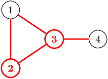

An infrastructure consisting of N cities, numbered from 1 to N, and M bidirectional roads between them is given. Roads do not intersect apart from at their start and end points (they can pass through underground tunnels to avoid collisions).

For each pair of cities directly connected by a road, let's define their network rank as the total number of roads that are connected to either of the two cities.

Write a function:

func Solution(A []int, B []int, N int) int

that, given two arrays A, B consisting of M integers each and an integer N, where A[i] and B[i] are cities at the two ends of the i-th road, returns the maximal network rank in the whole infrastructure.

Examples:

1. Given A = [1, 2, 3, 3], B = [2, 3, 1, 4] and N = 4, the function should return 4. The chosen cities may be 2 and 3, and the four roads connected to them are: (2, 1), (2, 3), (3, 1), (3, 4).
In the pictures below, the chosen cities and roads connected to them are marked in red.

2. Given A = [1, 2, 4, 5], B = [2, 3, 5, 6] and N = 6, the function should return 2. The chosen cities may be 1 and 2, and the two roads connected to them are: (1, 2), (2, 3).

Write an efficient algorithm for the following assumptions:

N is an integer within the range [2...100];

M is an integer within the range [1...4,950];

each element of arrays A and B is an integer within the range [1...N];

A and B have equal length;

each road connects two distinct cities;

two cities are connected by at most one direct road.

