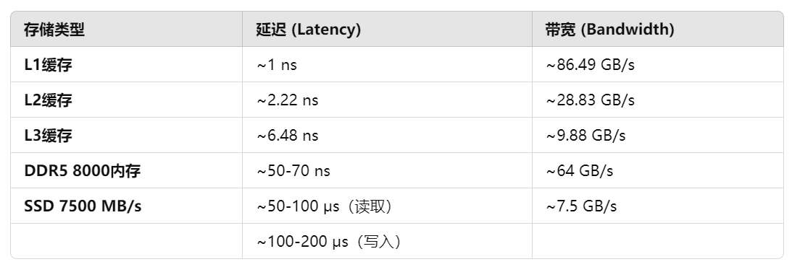

# Set the GOPROXY environment variable

export GOPROXY=https://goproxy.io,direct

# Set environment variable allow bypassing the proxy for specified repos (optional)

export GOPRIVATE=git.mycompany.com,github.com/my/private

# Set environment variable in windows 11

$env:GOPROXY = "https://goproxy.io"

$env:GOPROXY = "https://goproxy.cn"

# 查看环境变量

go env

# 修改运行中容器的配额

docker container update 29cac6d4108f --cpus="4" --memory="8g" --memory-swap="-1"

# 查看容器运行状态

docker stats 29cac6d4108f

# 开发时自动热启动

go install github.com/cosmtrek/air@latest

# cobra

- go get -u github.com/spf13/cobra/cobra
- go install github.com/spf13/cobra-cli@latest

- 要将微秒（μs）转换为纳秒（ns），只需将 μs 乘以 1000，因为 1 微秒等于 1000 纳秒。因此，50-100 μs 的范围等于 50,000-100,000 纳秒。
